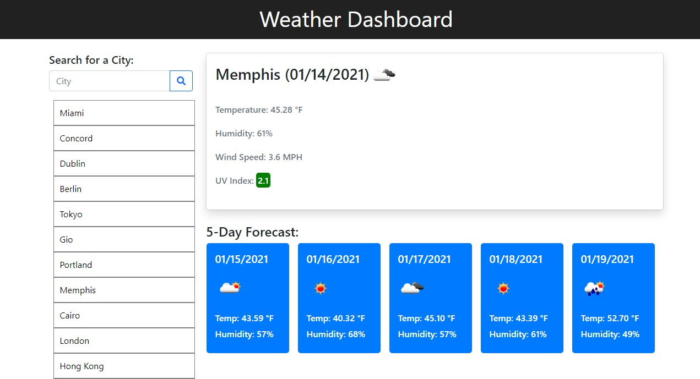
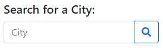
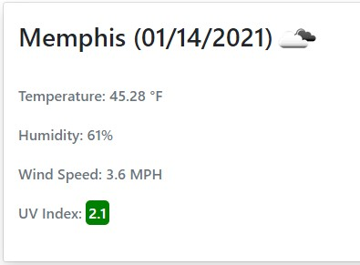
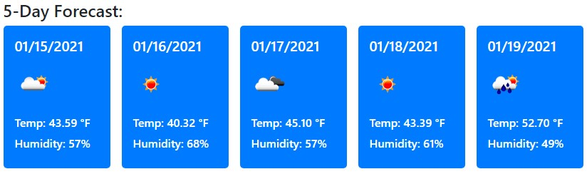
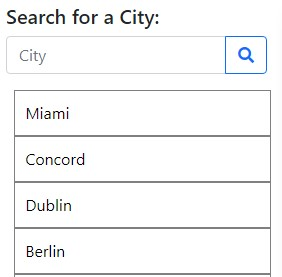

# Weather Dashboard

## Description

A weather dashboard that allows the user to search for various cities.  The dashboard will remember your city search history and display the date, temp, humidity, wind speed, UV index, and a 5-day forecast.  I used the free openweathermap API to query the information needed.

## Layout

The page layout is shown below.

## Usage

Enter a city into the search bar and select the magnifying glass to search for the weather for that city.

If the city is found by the API, the current weather conditions will be displayed in the main weather card. If the city is not found, the user is alerted with "City not Found".

A 5-Day forecast is also displayed underneath the main city card.

The city is then stored in the local storage and search history directly underneath the search text box.

## Links

Github link: https://github.com/TimMartin13/weather_dashboard

Published link: https://timmartin13.github.io/weather_dashboard/

## Contat Information

Phone: 612.799.1450
Email: timmartin13@gmail.com

